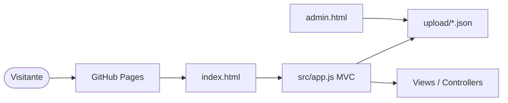

<div align="center">


### Portfólio · GitHub Pages · JSON-driven MVC


<br/>

[](https://brayansilver.github.io)
[](https://brayansilver.github.io)
[](https://github.com/BrayanSilver)
[](https://www.linkedin.com/in/brayan-r-silveira-b80636150/)
[](mailto:brayansilver.teen@gmail.com)


</div>

---

## 📌 Sobre

Portfólio pessoal com arquitetura **MVC (ES Modules)**, conteúdo em JSON, painel admin, projetos em destaque e carrosséis por categoria. Deploy no GitHub Pages.

**Site:** https://brayansilver.github.io

## 📊 Status cards

<div align="center">
  
  
</div>

<div align="center">
  
  
</div>

## 🔄 Arquitetura



## ▶️ Quick start

```bash
git clone https://github.com/BrayanSilver/brayansilver.github.io.git
cd brayansilver.github.io
npx serve .
```

| Caminho | Finalidade |
|---------|------------|
| `upload/info-pessoal.json` | Bio, hero, skills |
| `upload/projetos.json` | Projetos |
| `upload/contato.json` | Contato |
| `admin.html` | Painel admin |
| `src/` | App MVC |

## 🛠️ Skills


---

<div align="center">

**Brayan R. Silveira** · Full Stack Developer

[Portfolio](https://brayansilver.github.io) · [GitHub](https://github.com/BrayanSilver) · [LinkedIn](https://www.linkedin.com/in/brayan-r-silveira-b80636150/)


</div>
